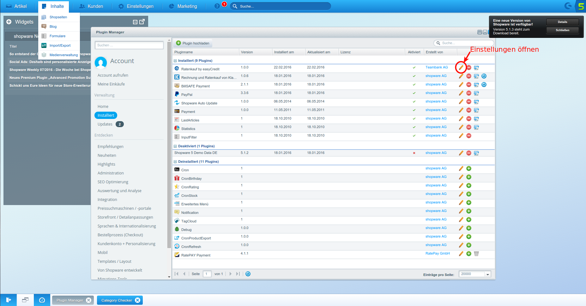
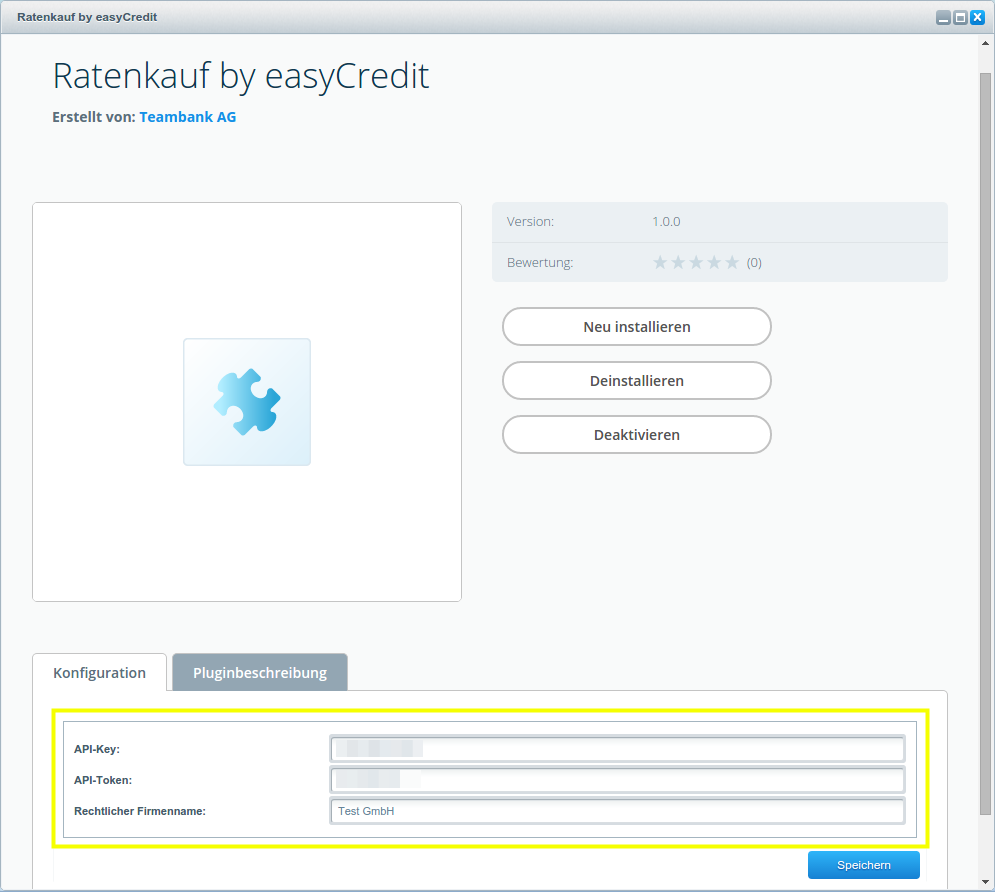
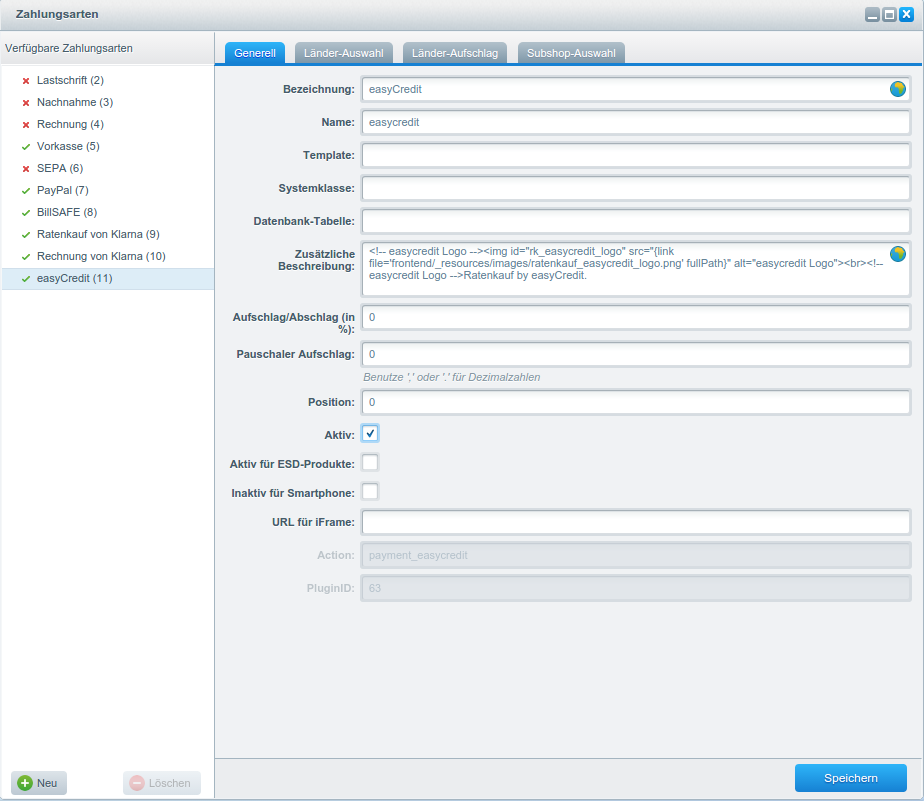
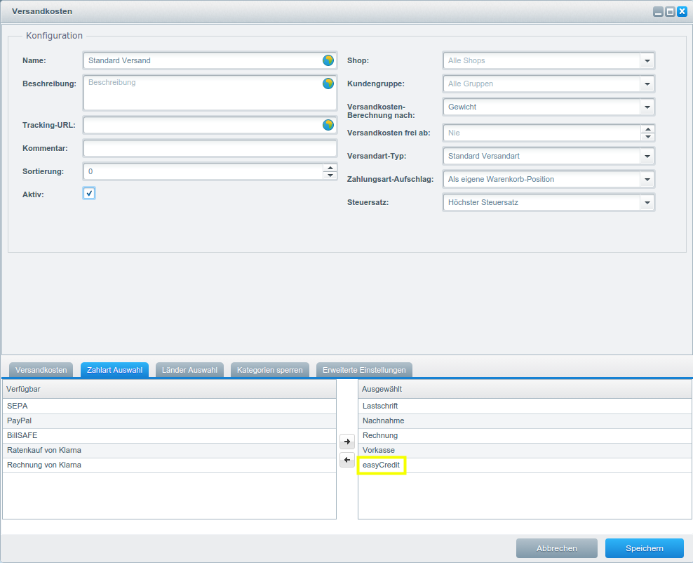

# EasyCredit Ratenkauf Shopware Plugin

Das easyCredit Zahlungsmodul für Shopware ermöglicht es Ihnen durch einfache Installation Ratenkauf by easyCredit in Ihrem Shopware-Store anbieten zu können. 
Weitere Informationen zu easyCredit finden Sie unter [Ratenkauf by easyCredit](https://www.easycredit.de/Ratenkauf.htm).

## Installation

Kopieren Sie das Plugin Verzeichnis *NetzkollektivEasyCredit* in:

`cp -R NetzkollektivEasyCredit /path/to/shopware/engine/Shopware/Plugins/Local/Frontend/`

Die folgenden Befehle installieren und aktivieren das Plugin.

```
cd /path/to/shopware/bin
./console sw:plugin:install NetzkollektivEasyCredit
./console sw:plugin:activate NetzkollektivEasyCredit
```

## Konfiguartion

### Plugin Konfiguration

Die Plugin Einstellungen finden Sie im Shopware Backend unter: 

`Einstellungen -> Plugin Manager -> Verwaltung -> Installiert -> Ratenkauf by EasyCredit -> öffnen`



Die folgenden Einstellungen können dann in dem Plugin Menü angepasst werden:



#### API-Zugangsdaten

Nach der Installation müssen hier die API-Zugangsdaten, die von der Teambank zur Verfügung gestellt werden, eingetragen werden.

#### Rechtlicher Firmenname

Zur korrekten Anzeige der rechtlichen Informationen nach Auswahl der Zahlungsmethode (Vereinbarung zur Datenübermittlung), ist es notwendig, dass der Händlername korrekt konfiguriert ist. Notwendig ist der Firmenname mit entsprechender Rechtsform.


### Allgemeine Bezahlmethodeneinstellungen

Allgemeine Einstellungen für die *Ratenkauf by easyCredit* finden Sie im Shopware Backend unter: 

`Einstellungen -> Zahlungsarten -> easyCredit`



Hier können Sie unter anderem die Bezahlmethode für das gesammte Shopware System aktivieren/dekativieren oder nur für einzelne Länder bzw Subshops zur Verfügung stellen.

### Bezahlmethode für Versandarten aktivieren

Im Shopware Backend können Sie unter:

`Einstellungen -> Versandkosten -> Versandart -> Zahlart Auswahl`

die *Ratenkauf by easyCredit* Bezahlmethode für eine bestimmte Versandmethoden aktivieren.




## Kompatibilität

Das Plugin wurde unter 5.1 getestet. Weitere Systemvoraussetzungen sind mit den von Shopware in der jeweiligen Vesion genannten abgedeckt.

