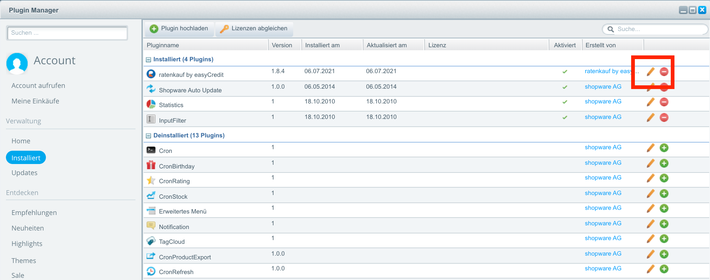
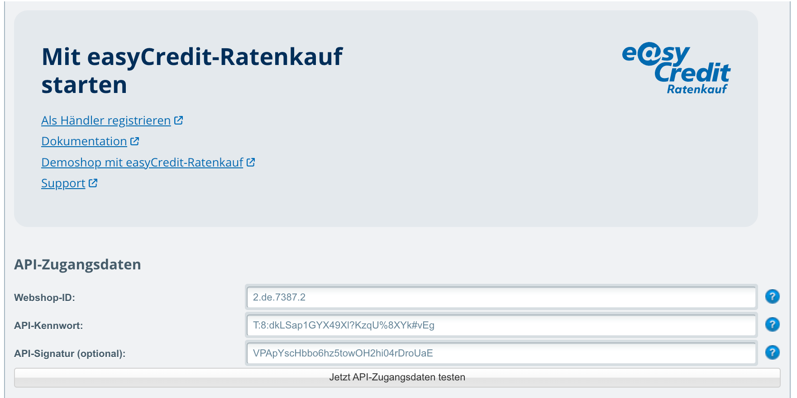
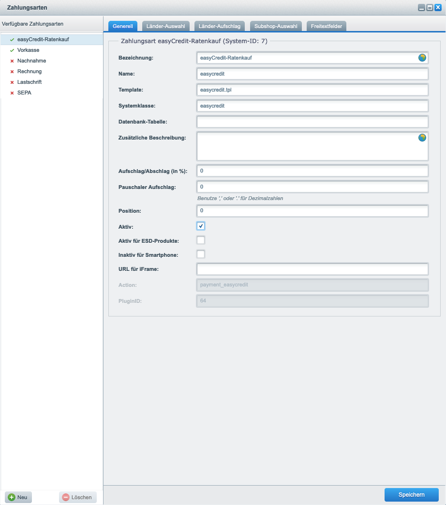
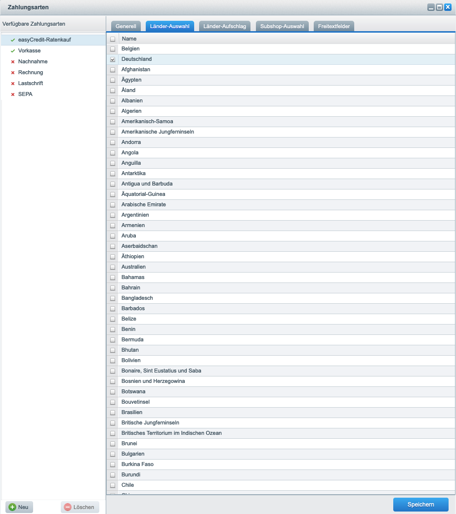
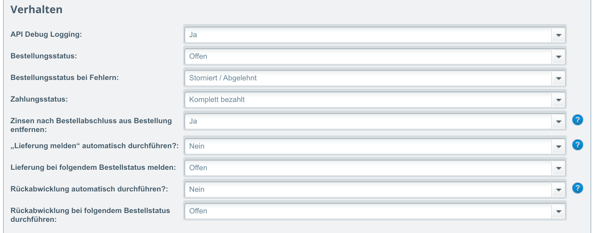
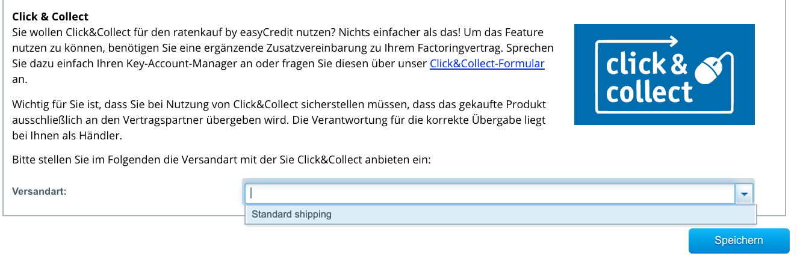

.. role:: latex(raw)
   :format: latex

.. _configuration:

Konfiguration
=============

Nachdem Sie die Installation erfolgreich abgeschlossen haben, konfigurieren Sie das Plugin. Damit das Plugin als Zahlungsmethode angezeigt wird, aktivieren Sie easyCredit-Ratenkauf als Zahlungsmethode für den deutschen Store.

Konfigurations Menü öffnen
--------------------------

Zur Konfiguration öffnen Sie im Backend erneut den Plugin-Manager. In der Liste der installierten Plugins sollte nun **easyCredit-Ratenkauf** enthalten sein.
In dieser Zeile klicken Sie das Stifte Icon, um die Plugin Konfiguration zu öffnen.

Zugangsdaten konfigurieren
---------------------------

Die Konfigurationsmöglichkeiten sind im Folgenden gezeigt. Als Mindestkonfiguration geben Sie hier Ihre Webshop-Id und Ihr API-Passwort an.

.. note:: Nach einem erfolgreichen Test der API-Zugangsdaten, vergessen Sie bitte nicht auf **Speichern** zu klicken.

Zahlungsart Einstellungen
-------------------------

Um die Zahlungsart **easyCredit-Ratenkauf** im Frontend anzuzeigen, muss die Zahlungsart aktiviert sein, und dem Land *Deutschland* zugewiesen werden. Navigieren Sie hierzu zu den Zahlungsart Einstellungen: :menuselection:`System -> Konfiguration -> Zahlungsarten -> easyCredit-Ratenkauf`
Im ersten Reiter **Generell** stellen Sie sicher, dass **easyCredit-Ratenkauf** aktiviert ist.

.. raw:: latex

    \clearpage

Aktivieren Sie als letzten Schritt nun im Reiter **Länder-Auswahl** das Land **Deutschland**.

Verhalten konfigurieren
-----------------------

Im diesem Bereich kann das Verhalten des Plugins gesteuert werden. Neben dem Debug-Logging und dem initialen Bestellstatus kann hier das automatische Melden der Lieferung und Rückabwicklung eingestellt werden.

Marketing konfigurieren
------------------------

Um erfolgreich mit easyCredit-Ratenkauf zu verkaufen, stellen wir Ihnen eine Reihe von Marketing-Komponenten zur Verfügung, die Sie ganz einfach in Shopware aktivieren können. So erzielen Sie eine optimale Präsentation der Finanzierung über easyCredit-Ratenkauf, für höhere Umsätze und zufriedene Kunden.

.. image :: ./_static/config-marketing.png

Click & Collect konfigurieren
------------------------------

Um *Click & Collect* für eine Versandart zu aktivieren, kann diese als *Click & Collect*-Versandart ausgewählt werden. Wählt der Kunde diese Versandart im Bezahlvorgang aus, wird dies bei der Finanzierungsanfrage entsprechend übertragen. Weitere Informationen finden Sie unter `Click & Collect <https://www.easycredit-ratenkauf.de/click-und-collect/>`_

