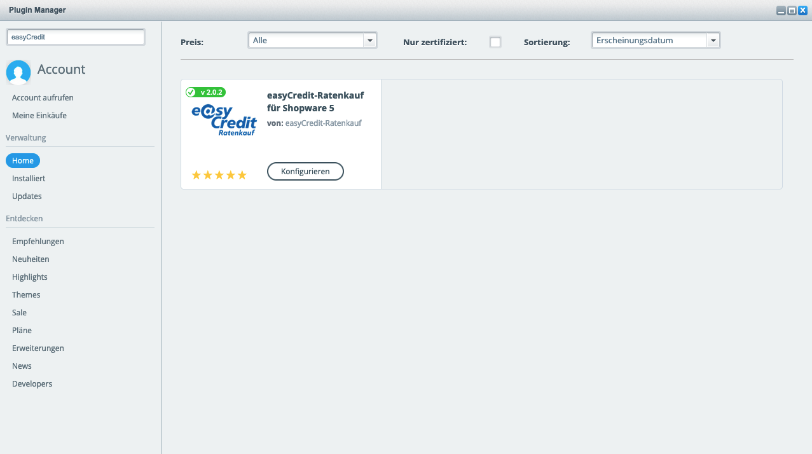

.. role:: latex(raw)
   :format: latex

Installation
============

Die Extension für ratenkauf by easyCredit kann im Plugin-Manager entweder über den direkten Download aus dem *Shopware Community Store* oder über den Datei-Upload des bereitgestellten Archives über *Plugin Hochladen* installiert werden.
Alternativ ist auch die Installation über die Kommandozeile möglich.

Shopware Community Store
------------------------

Zu Installation melden Sie sich im Backend Ihrer Shopware Installation an. Sie finden das Backend unter der folgenden URL: ``http(s)://mein-shop.tld/backend``.
Öffnen Sie im Backend nun den Plugin-Manager durch Klick im Menü auf :menuselection:`Einstellungen --> Plugin-Manager`.

.. note:: Als Shortcut verwenden Sie die Tastenkombination `Strg + Alt + P`.

Sie finden das Plugin, indem Sie in Suche oben links **easyCredit** eingeben:

Das Plugin wird Ihnen nun zur Installation angezeigt. Installieren Sie das Plugin nun durch Klick auf **Installieren**.
Die Extension wird automatisch heruntergeladen und installiert.

Fahren Sie anschließend mit der :ref:`configuration` fort.

manueller Datei-Upload
---------------------------------

Gehen Sie analog zur Installation aus dem Shopware Community Store vor. Im Plugin-Manager wählen Sie im linken Menü :menuselection:`Verwaltung --> Installiert`. Klicken Sie nun auf den Button *Plugin hochladen*. Wählen Sie den lokalen Pfad aus, unter dem sich das ZIP-Archiv des Shopware Plugins befindet und klicken Sie anschließend auf *Plugin hochladen*.

Fahren Sie anschließend mit der :ref:`configuration` fort.

.. image:: ./_static/installation-file_upload.png

Kommandozeile
-------------

Um das Plugin über die Kommandozeile zu installieren, führen Sie die folgenden Befehle aus:

.. code-block:: console

    $ wget https://www.easycredit-ratenkauf.de/download/easycredit-shopware-x.x.x.zip
    $ cp easycredit-shopware-x.x.x.zip /sw-base-dir/engine/Shopware/Plugins/
    $ cd /sw-base-dir/engine/Shopware/Plugins/
    $ unzip easycredit-shopware-x.x.x.zip
    $ rm easycredit-shopware-x.x.x.zip

Um sicher zu gehen, überprüfen Sie, ob das folgende Verzeichnis existiert: ``engine/Shopware/Plugins/Netzkollektiv/EasyCredit``. Im Anschluss installieren und aktivieren Sie das Plugin mit den folgenden Befehlen:

.. code-block:: console

    $ cd /sw-base-dir
    $ ./bin/console sw:plugin:refresh
    $ ./bin/console sw:plugin:install NetzkollektivEasyCredit
    $ ./bin/console sw:plugin:activate NetzkollektivEasyCredit

Fahren Sie anschließend mit der :ref:`configuration` fort.

Sollten Ihnen die Zugangsdaten bereits vorliegen, können Sie diese gleich bei der Installation mit den folgenden Befehlen setzen:

.. code-block:: console

    $ ./bin/console sw:plugin:config:set NetzkollektivEasyCredit easycreditApiKey 1.de.1234.4321
    $ ./bin/console sw:plugin:config:set NetzkollektivEasyCredit easycreditApiToken abc-def-ghi
