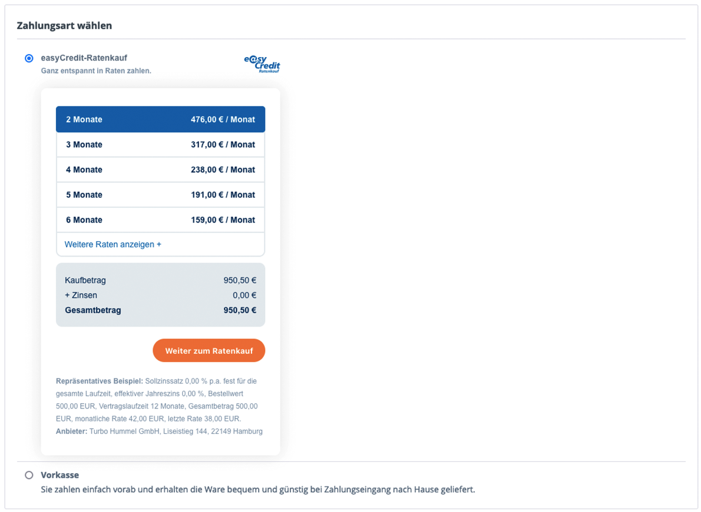
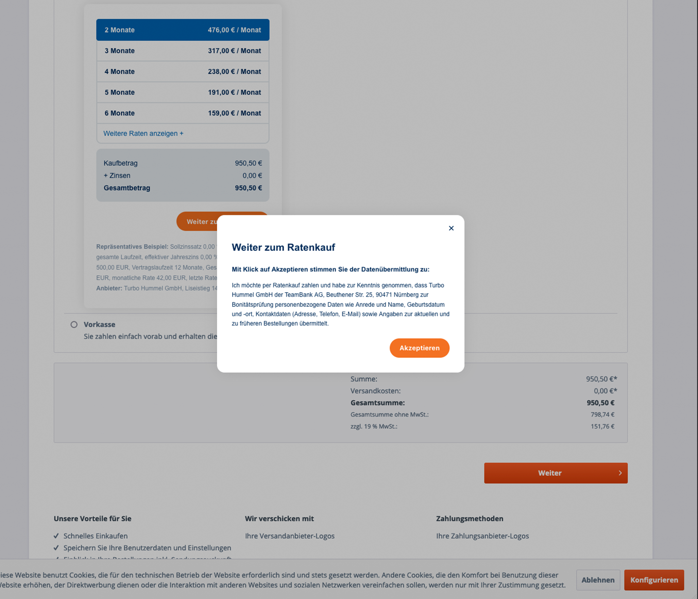

======================
Verwendung für Kunden
======================

Voraussetzungen für die Zahlung
---------------------------------

Eine Zahlung über easyCredit-Ratenkauf ist unter den folgenden Bedingungen möglich:

* es handelt sich um eine Privatperson
* die Rechnungs- und Lieferadresse des Kunden sind identisch
* die Adresse befindet sich in Deutschland
* der Bestellwert befindet sich innerhalb des von easyCredit-Ratenkauf angebotenen Finanzierungsrahmens (derzeit: 200 bis 10.000 EUR)

Bestellvorgang
--------------

easyCredit-Ratenkauf wird als Zahlungsmethode im Bezahlvorgang angezeigt. Nach Bestätigung der Zustimmungserklärung wird der Kunde auf das Zahlungsterminal von easyCredit-Ratenkauf weitergeleitet.

.. note:: Vor Bestätigung der Zustimmungserklärung und Weiterleitung auf das Zahlungsterminal werden keine persönlichen Daten des Kunden an easyCredit-Ratenkauf weitergegeben.

Überprüfung der Bestellung
--------------------------

Nach Rückleitung vom Zahlungsterminal gelangt der Nutzer auf die Bestätigungsseite, auf der er seine gesamte Bestellung nochmal überprüfen kann. Hier werden ihm inbesondere der aktualisierte Gesamtbetrag und die anfallenden Zinsen transparent angezeigt. Auch hat er nochmal einen Überblick über die gewählten Raten. Nach Bestätigung der Bestellung erhält der Kunde die vom System erstellte Bestellbestätigungsemail (sofern eingestellt).

