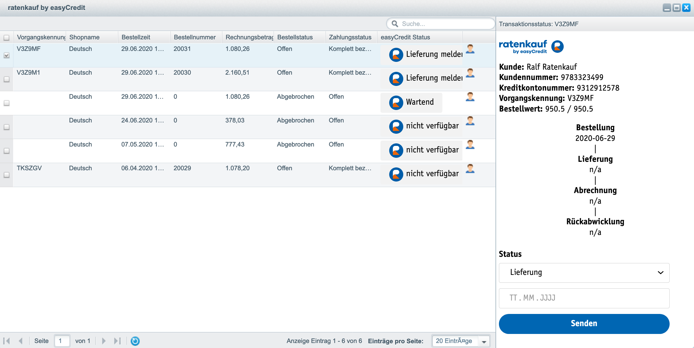
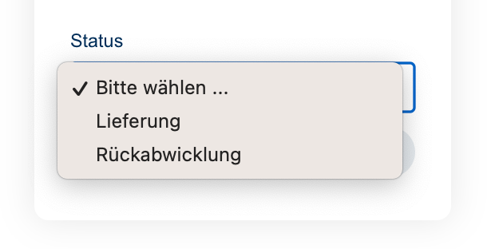
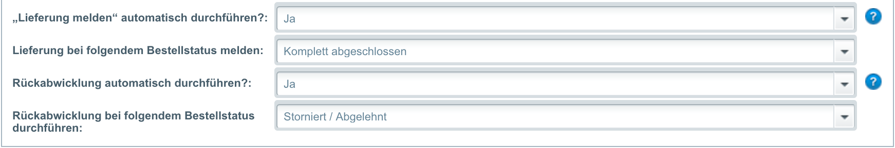

======================
Verwendung für Händler
======================

Eine neue Bestellung eines Kunden ist nach ihrem Eingang in Shopware gegenüber easyCredit-Ratenkauf genehmigt. Das heisst, die Zahlung und Bestellung wurde von easyCredit-Ratenkauf gegenüber dem Kunden bestätigt. Eine Auszahlung durch easyCredit-Ratenkauf an den Händler erfolgt erst, wenn der Händler die Lieferung der bestellten Artikel gemeldet hat. Dies erfolgt in Shopware entweder durch eine Bestätigung über die Transaktionsverwaltung oder durch eine Änderung des Bestellstatus gemäß folgender Einstellungen.

Alternativ ist die weitere Verwaltung des Transaktionsstatus über das `Partnerportal <https://partner.easycredit-ratenkauf.de/portal/>`_ möglich.

Transaktionsmanager
-------------------

Der Transaktionsmanager in der Detailansicht einer mit easyCredit-Ratenkauf bezahlten Bestellung zeigt eine Übersicht über die zur Bestellung gehörende Zahlungstransaktion und deren Historie. Über den Transaktionsmanager kann der Transaktionsstatus aus dem Shopware Backend heraus direkt an easyCredit-Ratenkauf gemeldet werden.

Statusmeldung über den Transaktionsmanager
~~~~~~~~~~~~~~~~~~~~~~~~~~~~~~~~~~~~~~~~~~~~~~~~

Zur Meldung des Transaktionsstatus wählen Sie den gewünschten Status und senden Sie das Formular ab. Der Transaktionsmanager aktualisiert nach Absenden die Historie und die Transaktionsdetails oberhalb.

Bei Rückabwicklung wählen Sie bitte den Grund und geben Sie bei einer Teil-Rückabwicklung den entsprechenden Betrag ein.

Statusmeldung über die Bestellverarbeitung
----------------------------------------------------

Neben der expliziten Meldung über den :ref:`Transaktionsmanager` integriert die Extension die Statusmeldung auch in die Bestellverarbeitung von Shopware. Bei der Änderung des Bestellstatus meldet das Plugin den Status implizit je nach entsprechender Einstellung. Die Einstellungen sind unter :ref:`Plugin konfigurieren` zu finden.

.. warning:: Die Bestellung ist nicht direkt nach dem Bestelleingang als Transaktion vorhanden. Dies kann bis zu 24 Std. dauern. Die automatische Meldung des Transaktionsstatus funktioniert nur, wenn die Bestellung bereits bei easyCredit-Ratenkauf vorhanden ist.

Lieferung melden
~~~~~~~~~~~~~~~~~~~~~~~~~~~~~~~~~~~~~~~~~~~~~~~~

Wird der Bestellstatus vom Händler auf den eingestellten Status geändert, meldet das Plugin die Lieferung im Hintergrund automatisch.

.. note:: Die Meldung entspricht dem Status "Lieferung melden" über den Transaktionsmanager.

Rückabwicklung
~~~~~~~~~~~~~~~~~~~~~~~~~~~~~~~~~~~~~~~~~~~~~~~~

Wird der Bestellstatus vom Händler auf den eingestellten Status geändert, meldet das Plugin die Rückabwicklung im Hintergrund automatisch.

.. note:: Die Meldung entspricht dem Status "Widerruf vollständig" über den Transaktionsmanager.

Anzeige des Transaktionsstatus
--------------------------------------

Der Transaktionsstatus kann einen der folgenden Werte annehmen:

* Wartend: die Transaktion ist noch nicht verfügbar. Es kann bis zu einem Tag dauern bis die Transaktion verfügbar ist.
* Lieferung melden: Die Transaktion ist vorhanden. Die Lieferung kann gemeldet werden.
* In Abrechnung: Die Lieferung wurde gemeldet. Die Auszahlung an den Händler wird bearbeitet.
* Abgerechnet: Die Auszahlung an den Händler ist erfolgt.
* Rückerstattet: Die Transaktion wurde widerrufen.
